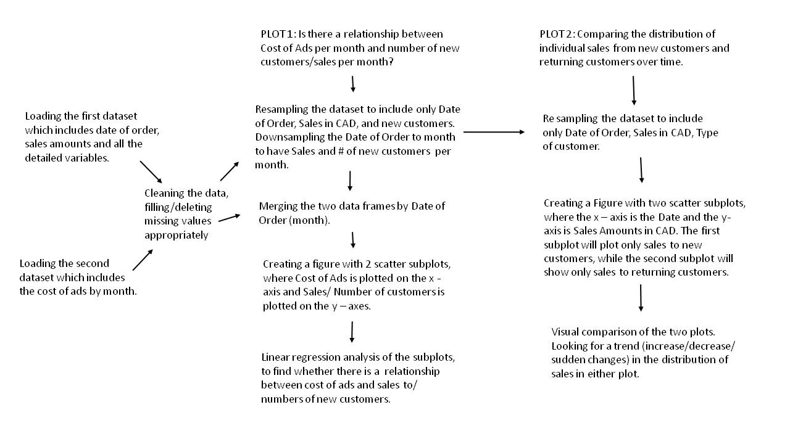

Final Project on Marketing
Miriam Baumann
2015-11-09

Ten Minute Plan: 

The code in this repository can be used to analyze past sales data of a company. This can help create an 
effective marketing plan for the company. 
The code, loads, organizes, visualises, plots and analyzes multiple datframes by using different functions.  

The following flowchart explains what the code will do in more detail:  

The code is seperated across two python scripts; the first script creates plot 1 and the second script creates plot 2. 
The Shell script which describes how to use the python scripts, is named Master.sh, and can be found in the 
root directory of the project. The Master.sh file can be run through GitBash by typing: bash Master.sh  . 
This will run both scripts and save two plots to the root directory. When running the shell script from GitBash you must 
make sure you are in the directory that the shell script is located, otherwise you must provide 
the filepath. 