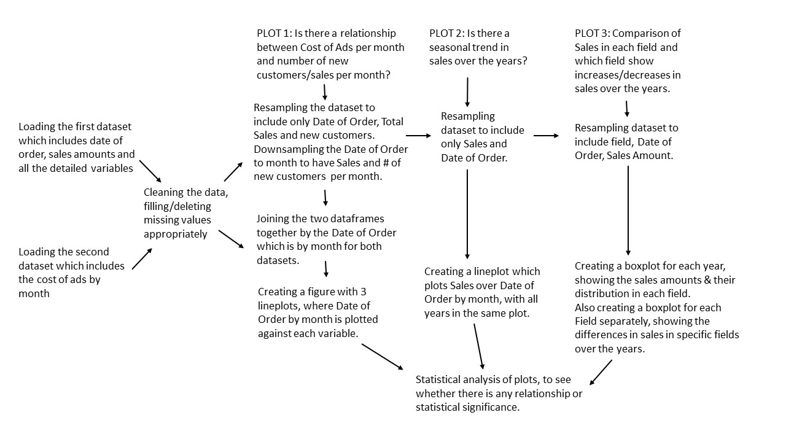

Final Project on Marketing
Miriam Baumann
2015-11-09

Ten Minute Plan

This program is used to create a marketing plan for a company. It is able to visualize and analyze sales data by using different functions. 
The sales data includes main variables such as date of order, sales amount  and cost of ads, as well as more detailed variables that may 
differ in sales data from different companies. 

Current Issues: 
In Plot 1: I am currently having issues running linear regression statistical test on plot 1. I get an error telling me that a name is 
not defined and I dont know how to fix that.
 
In plot 2: I plotted Sales across time to see whether there is a correlation between month and Sales. I have the plot but i dont know how 
to statitically analyze it to find whether there is a correlation between month and Sales.
 
In Plot 3: In plot 3 I am trying to plot a violinplot of the different fields instead of the boxplots of the fields, but somehow this is
not working for me. I dont know how to plot multiple violin plots on one plot. Within plot 3 I am also trying to define a function called 
businessyear. This function is supposed to take out all dates in a specific business year and return these rows in a new table. Any suggestions
on how this could work?

In Plot 4: I have a plot of sales from new customers and returning customers over time. I did a t-test on the data, however I am not sure 
if this is the right test to run here. The p value i get is 0.0 and i feel like this test isnt really telling me anything. 
If you have any suggestions on what other tests i could run that are more significant? Or is there a way of plotting a best fit line for 
each new customers and returning customers and then comparing them? 

